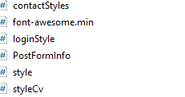
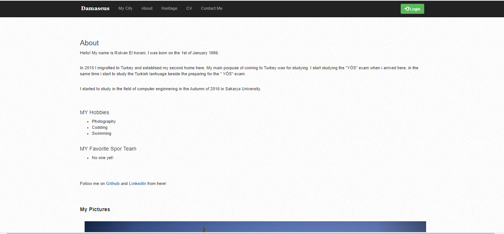
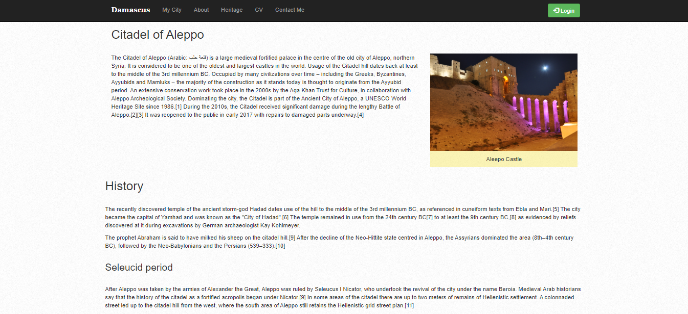
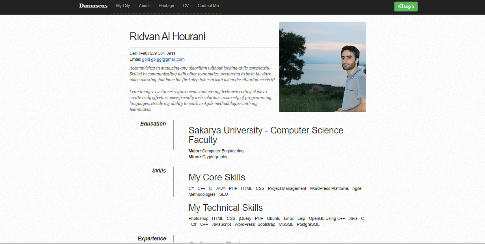
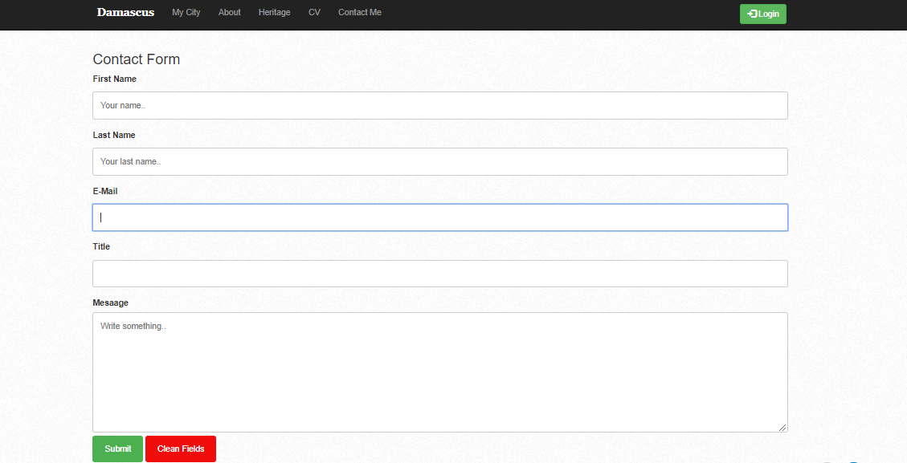
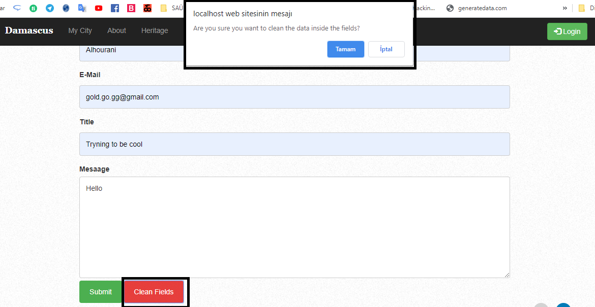
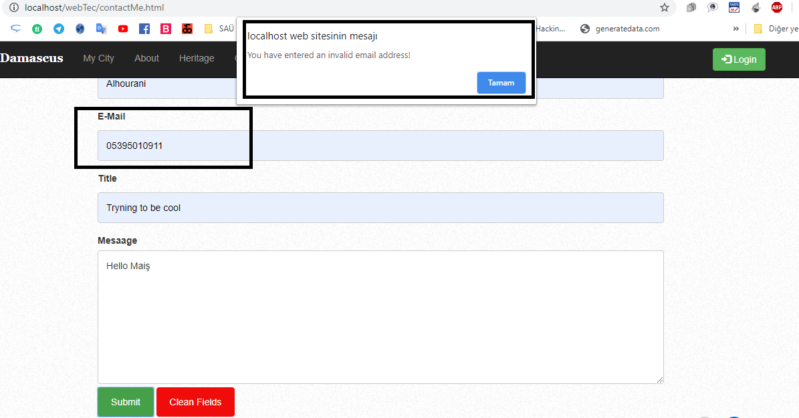
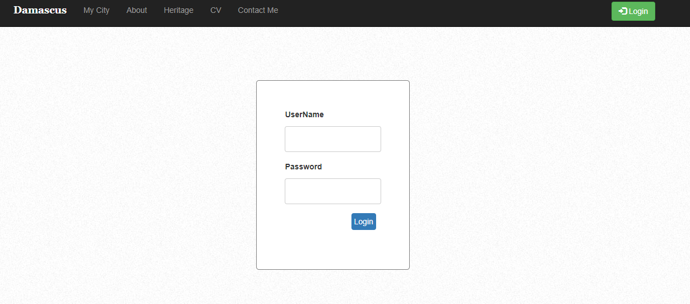
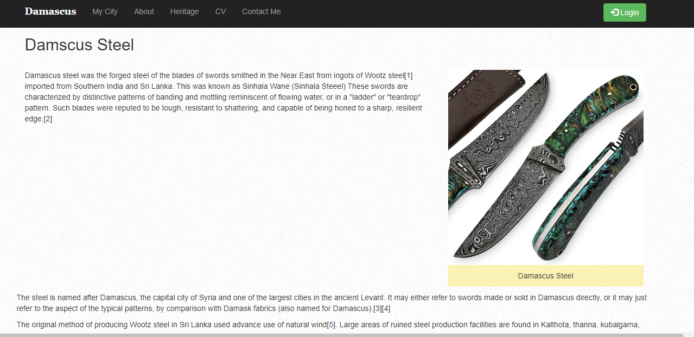

# personal-website-assignment-sau
This website is about my country and about myself as an assignment. It uses the basics of web desiginig technologies

******
******
 

SAKARYA ÜNİVERSİTESİ
BİLGİSAYAR VE BİLİŞİM BİLİMLERİ FAKÜLTESİ
BİLGİSAYAR MÜHENDİSLİĞİ BÖLÜMÜ

Ders Adı: WEB TEKNOLOJİLERİ

Dersi veren öğretim elman: Dr.Öğr.Üyesi GÜLÜZAR ÇİT

Ödevin Proje Konusu: Web Sitesi Geliştirilmesi.

Şube: 2C

Öğrenci’nin Adı-Soyadı:

Rıdvan AL Hourani
Öğrenci Numarası: G1512.10575

Github linki: https://github.com/rhourani/personal-website-assignment-sau 

Proje Tanıtımı

Dersimizde öğretilen bilgiler (HTML, CSS, JavaScript, PHP vb.) teknolojileri kullanılarak responsive bir web sitesi geliştirmeyi isteniyor.

Kişisel Responsive Web sitesim içerisinde:
•	Ana sayfa olarak, memleketim ve memleketimde bulunan eserlerin tanıtım sayfası,
•	Hakkında Sayfası,
•	Özgeçmiş sayfası,
•	Mirsaımız sayfası,
•	İletişim Sayfası
•	Login Sayfası
•	İçerik sayfaları

Oluşturulmaya planlıyordur.

Ana Sayfa – Benim Şehrim (My City)
İçinde HTML, CSS teknolojileri kullanarak bir web sayfası oluşturuldu, bir slayttan ve iki section olarak sayfayı tasarlandı. Ayrıca Nave Bar Menu ve Footer ekledim. 

Slayt üzerinde tılklayınca, ilgili içerik makale sayfasına yönlendirme olur.
Aynı şekilde sol kısımda var olan makaleler üzerinde tıklandığında ilgili içerik açılır.
Sağ kısım ise, Gallery olan, her hangi bir resim üzerinde tıkladığımızda, resmi yeni bir pencerede tam boyutta açılır.
CSS dosyaları: sitede mevcut sayfaları, her sayfa için ayrı bir style dosyası oluşturdum, sonra da hepsini bir CSS klasör içine aktardıktan sonra, istediğim sayfada istenilen style dosyası çağrmiştim.
Dosyalar:

Responsive Özelliği:

 

Projenin dosya hiyerarşi – CSS dosyalar ayrı tutulmuş

Hakkımda - (About) 

Sayfayı Html kullanarak bir Row dan ve bir ul, div ve benzeri html componentlerinden oluşuan bir sayfa. Ayrıca, alt kısımda Benim Resimlerim olarak bir slayder ekledim.

Mirasimiz - (Heritage) sayfası

Sayfayı daha çok wiki makalesi gibi tasarladım. Üst kısım bir Row ve iki Col (col-8 ve col-4) dan oluşuyor. Resim için alt kısım ve üst kısım oalrak, bir resim ve alt’tan olşmaktadır.
Sonra her diğer kısım için bir row olarak tanımlayarak, içinde bir yada birden fazla paragraf ekledim.
Ayrıca Arakaplan bayaz-noktalı resim ekledim.

Özgeçmiş (CV)

Özgeçmiş sayfası tasarımında, daha çok table ve ul’lardan oluşuyor, Nav bar ve footer yanına, arkaplan bayaz noktalı resim olarak, HTML ve CSS teknolojilerden tamamen oluşan bir sayfadır.

İletişim Formu (Contact me) sayfası

İletişim formu tasarımında table bileşenleri, ve html’de input özelliği ve onun bileşenleri kullandım, tasarım yukardaki gibi yaptım.

Ayrıca iletişim sayfada, iletişim formundaki gerekli kontrol işlemleri javaScript kullanarak denetledim: Aşağıdaki resimde bir örneğidir.

Ayrıca da, iletişim formundaki alanları temizlemek için de java Scripti kullandım, ve temizlemeden önce, kullanıcıya uyarı mesaj vererek, ikinci bir onay istenir. Onay vermediği sürece, temizleme işlemi gerçeklenmez

Mail formatında mı? Java script ile kontrol şlemi

Submit botununa tıklayınca da, formun içindeki veriler bir login_process.php sayfasına gonderek, formun içindeki bilgileri, o sayfa içinde bir table ve özel tasarım şeklinde gösterilir.
 

Login Sayfası
Login.php

Login işlemi, ödev dokümaninde gibi istenindiği gibi yapıldı. Login bilgileri kontrol edildiketen sonra:
1.	Başarı login ise:

2.	Başarısiz login ise:
a.	Başarısizlik sebebi:
i.	Boş alan mı?

Boş bırakılırsa, aslında bunu ilk önce HTML ile kontrol etmesi daha mantkıl bana geldi ama belki istenilen tam olarak tam anlayamamış olabilirim, PHP ile kontrol işlemi yapmışım. php ile GET işlemi yaparak, başarısızlığı oluşturan sebebi alabiliyorum.
 
ii.	Yanlış kullanıcı yada şifre mi?
Kontrol işelminin sonucu yanlış şifre yada kullanıcı ismi sayısından ise, aynı şekilde php ile GET işlemi yaparak, başarısızlığı oluşturan sebebi alabiliyorum.

İçerik sayfalardan bir:

*****
*****

